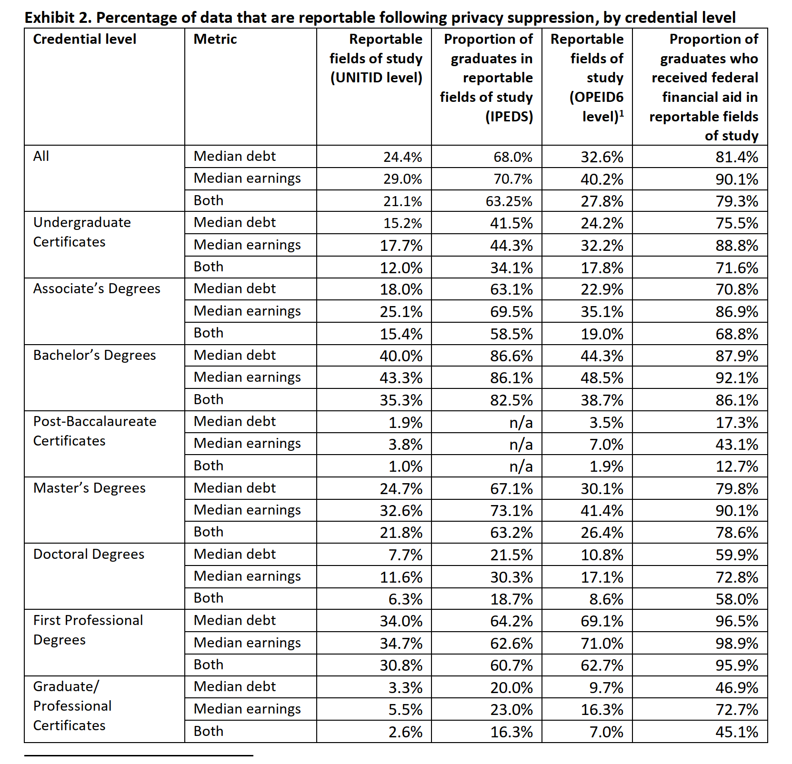

###Introduction  

According to to the article 'Cell suppression: Disclosure protection for sensitive tabular data', "*When a statistical agency, such as the United States Bureau of the Census, publishes tabular data, it must withhold certain data elements that contain confidential information associated with the data respondents. Cell suppression is a technique commonly used in the publishing of economic data in tabular formats.*"  An example of this is the data used for analysis in this project.  The College Scorecard is an online government website that has financial information pertinent to the cost of post secondary education.  As per The College Scorecard cell suppression techniques were used to "*reduce the risk of disclosure of confidential or indentifying*."  



Libraries Used
```{r, warning=FALSE, message=FALSE}
library(dplyr)
library(tidyverse)
library(lubridate)
library(tidyquant)
```


Importing CSV File
```{r}

df<-read_csv("https://raw.githubusercontent.com/engine2031/Data-607/main/Project%202_Privacy%20Suppresion%20Education%20Data2.csv")
head(df)
```


Filling 1st column blank values
```{r}
df2 <- df %>% mutate(Credential_Level = na.locf(df$'Credential level')) %>% 
  relocate(Credential_Level, .after = `Credential level`)

df3 <- df2 %>% select(-'Credential level')
head(df3)
```

Renaming of columns names to shorten length
```{r}
df4 <- rename(df3, 'Field of Study Type 1' = c(3), 'Graduates' = c(4), 'Field of Study Type 2' = c(5), 'Graduates with Financial Aid' = c(6))
head(df4)
```

Changing data structure from wide to long
```{r}
df5 <- df4 %>% pivot_longer(c(`Field of Study Type 1`, 'Graduates', `Field of Study Type 2`, `Graduates with Financial Aid`), names_to = 'Education Type', values_to = 'Reportable_Data')
df5
```

String Manipulation to clean up the data. 
```{r}

df5$Credential_Level  <- str_replace_all(df5$Credential_Level, "\\n", " ")
df5$'Reportable_Data' <- str_remove(df5$'Reportable_Data', "%")
df5$'Reportable_Data' <- as.integer(df5$'Reportable_Data')

head(df5)
```
Filter Data in preperation for Data Visualization
```{r}
field_of_study <- df5 %>% filter(Metric=='Median debt') %>% 
    filter(Credential_Level != 'All') %>% filter(`Education Type`!='Graduates')%>%
    filter(`Education Type`!='Graduates with Financial Aid')
head(field_of_study)
```

Data Visualization for Report Data for Median Debt
```{r}
field_of_study %>%
  ggplot(aes(x=reorder(Credential_Level,Reportable_Data),y=Reportable_Data, fill = `Education Type`)) + 
  geom_bar(stat = 'identity',position=position_dodge()) +
  scale_fill_brewer(palette="Paired") +
  labs(y = ("Reportable Data (%)"),x = ("Credential Level"),
      title = ("Reportable Data per Credential Level"))+ 
  theme_minimal()+
  theme(axis.text.x = element_text(angle = 65, hjust = 1))

```

##References
https://onlinelibrary.wiley.com/doi/abs/10.1002/net.3230220407#:~:text=Cell%20suppression%20is%20a%20technique,economic%20data%20in%20tabular%20formats.&text=Additional%20entries%20in%20the%20table,value%20of%20each%20primary%20suppression.

